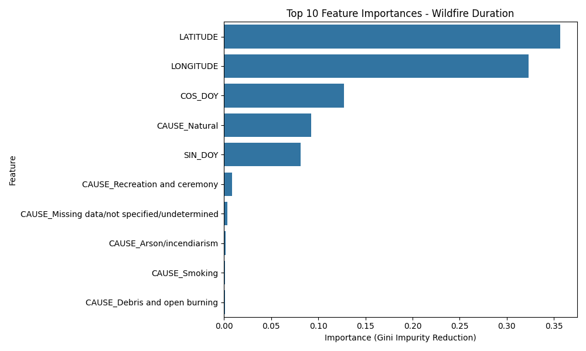
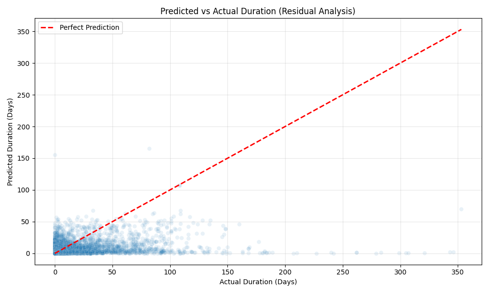

# Wildfire Analysis: 2.3 Million US Fires, 1992–2020

I lived in Los Angeles for ten years, and over that time it felt like the fires kept getting worse. I wanted to find out whether that impression holds up against the data, so I took the US Forest Service's national record of wildfires and worked through it in two parts: a descriptive story in Tableau, then a model in Python that estimates how long a fire will burn from what is known when it is first reported.

## Questions

1. Are wildfires getting worse?
2. What causes them, and where and when do they happen?
3. How are landowners responding, and can that response be measured?

## Data

Short, Karen C. 2022. *Spatial wildfire occurrence data for the United States, 1992–2020 [FPA_FOD_20221014].* 6th Edition. Fort Collins, CO: Forest Service Research Data Archive. https://doi.org/10.2737/RDS-2013-0009.6

- 2,303,566 fire records × 38 fields, 1992–2020, distributed as a SQLite database.
- Fire sizes range from near zero to 662,700 acres.
- Many fields are incomplete. For example, the containment date is missing for 894,813 records and the discovery time for 789,095. I filtered around the gaps rather than filling them in.

The database is about 1 GB, so it is not in this repo. `scripts/download_data.py` fetches it (see [How to run](#how-to-run)).

## Part 1: Descriptive analysis (Tableau)

Interactive dashboards: [Tableau Public link coming]

**Are fires getting worse?** For the largest fires (Class G, 5,000 acres and up), acres burned trend upward over the period, with higher highs and higher lows.

**Causes.** Human-caused fires far outnumber natural ones, but natural causes (mostly lightning) account for most of the acreage burned, about 105.6 million acres. Smaller fires (Classes B and C) are most often debris and open burning.

**Where and when.** An animated seasonal map shows large fires starting in the South, especially Texas, in winter and shifting to the West and Northwest by summer. Western fires last the longest, peaking in August. A few things I flagged for follow-up rather than explained: a June spike in Class G acreage in Arkansas, December fires in Texas, and a 2010 outlier in the Northeast.

**Land ownership and response.** The US Forest Service, the Bureau of Land Management and private landowners account for the most acres burned. To compare how quickly fires are brought under control, I built a **Control Efficiency Score**: 1 ÷ (average acres burned per hour until control).

It is not fair to rank agencies with that score as it stands. It ignores terrain, elevation, weather and the resources each agency has. The Forest Service and the BLM manage very different land, so a lower score may reflect steep, remote country rather than a slower response. Before drawing conclusions from it, I would add terrain, elevation, historical weather and fire perimeter data.

**What I'd do with it.** Use the seasonal pattern to pre-position federal and state firefighting resources, and time public awareness campaigns to the months and regions where human-caused fires peak.

## Part 2: Predicting fire duration at discovery

**Question:** when a fire is first reported, can we estimate how long it will burn? An early warning that a fire is likely to run long would give crews time to move resources before it grows.

**Sample.** 630,053 fires discovered from 2010 onward that have a recorded containment date. Duration is containment date minus discovery date, in days. Records with a negative duration (contained before discovered) are dropped as data errors.

**Features** (only what is known at discovery):
- latitude and longitude
- general cause (one-hot encoded; 13 categories)
- day of year, encoded as sine and cosine so that December 31 sits next to January 1

Fire size class is left out on purpose. It records the fire's final size, which isn't known at discovery, so using it would leak the answer into the inputs.

**Model.** Random Forest regressor (100 trees, max depth 10), an 80/20 train/test split, and 5-fold cross-validation on the training set.

**Results**

| Metric | Value |
|---|---|
| Cross-validation RMSE (5-fold, training set) | 6.33 days (± 0.13) |
| Test RMSE | 6.60 days |
| Test MAE | 1.38 days |
| Baseline: standard deviation of duration (always predicting the mean) | 7.05 days |

The target is zero-inflated. The median duration is 0 days, since most fires are contained the day they are found, and a small number burn for months. That's why MAE is low while RMSE stays close to the baseline: the model does well on the many short fires and misses the long ones.

The most important features are latitude, longitude, cos(day of year) and a natural cause. Where and when a fire starts, and whether lightning started it, carry most of the signal.





## What this model can't do

- **Predict long fires.** In the residual plot, fires that burned for 100+ days are mostly predicted to last only a few days. Without wind, humidity, temperature and fuel conditions, the model has no way to tell a fire that will run for months from one that will go out overnight.
- **Beat the naive baseline by much.** Test RMSE is about 6% better than always predicting the average. The signal is real but modest. It is most useful for flagging fires that are likely to be short, not for sizing up the dangerous ones.
- **Generalize forward in time, as measured here.** The train/test split is random, so fires from the same season and area appear on both sides. A time-based split is the honest test for a model meant to be used on future fires (see next steps).

## Next steps

- Switch to a time-based train/test split (train on earlier years, test on later ones) to remove leakage between neighboring fires.
- Join NOAA weather observations at the time and place of discovery.
- Compare against a plain linear model as a control, so the Random Forest's gain is measured rather than assumed.
- Tune hyperparameters.
- Serve predictions through a small API for field use.

## How to run

```bash
python -m venv .venv
source .venv/bin/activate        # Windows: .venv\Scripts\activate
pip install -r requirements.txt

python scripts/download_data.py  # about 214 MB download, about 1 GB unzipped, into data/
python run_pipeline.py
```

The pipeline logs its progress, prints cross-validation and test metrics, and writes `feature_importance.png` and `residuals.png` to the working directory. To keep the database somewhere else, set `WILDFIRE_DB_PATH` to its full path.

The notebook in `notebooks/` walks through the same steps using the functions in `src/`. To open it, run `pip install jupyter`, then `jupyter notebook notebooks/wildfire_duration_model.ipynb`.

## Repo layout

```
src/
  data_loader.py     # SQLite query: 2010+, fires with a containment date
  features.py        # duration target, cyclical day of year, cause encoding, leakage guard
  train_model.py     # Random Forest, 5-fold CV, test metrics, plots
run_pipeline.py      # runs load -> features -> train with logging
notebooks/           # walkthrough notebook (uses src/)
scripts/
  download_data.py   # fetches the USFS SQLite archive into data/
docs/img/            # plots from the run reported above
```

## Stack

Tableau, Python, SQLite, pandas, NumPy, scikit-learn, Matplotlib, Seaborn, Jupyter.

## License

Code is MIT licensed (see `LICENSE`). The wildfire data belongs to the USDA Forest Service and is subject to its own terms; please cite it as shown above.
