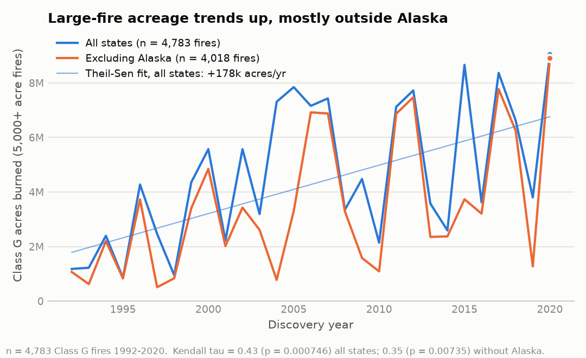
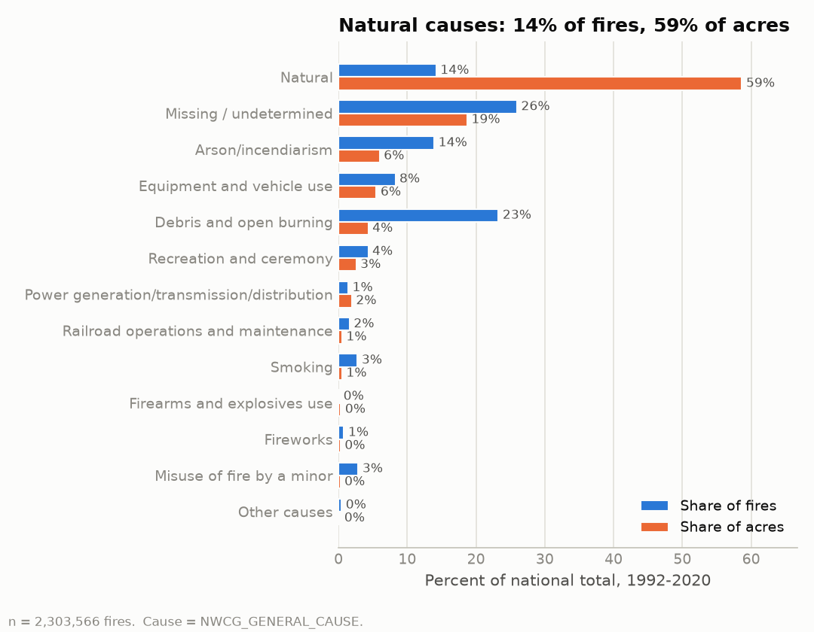
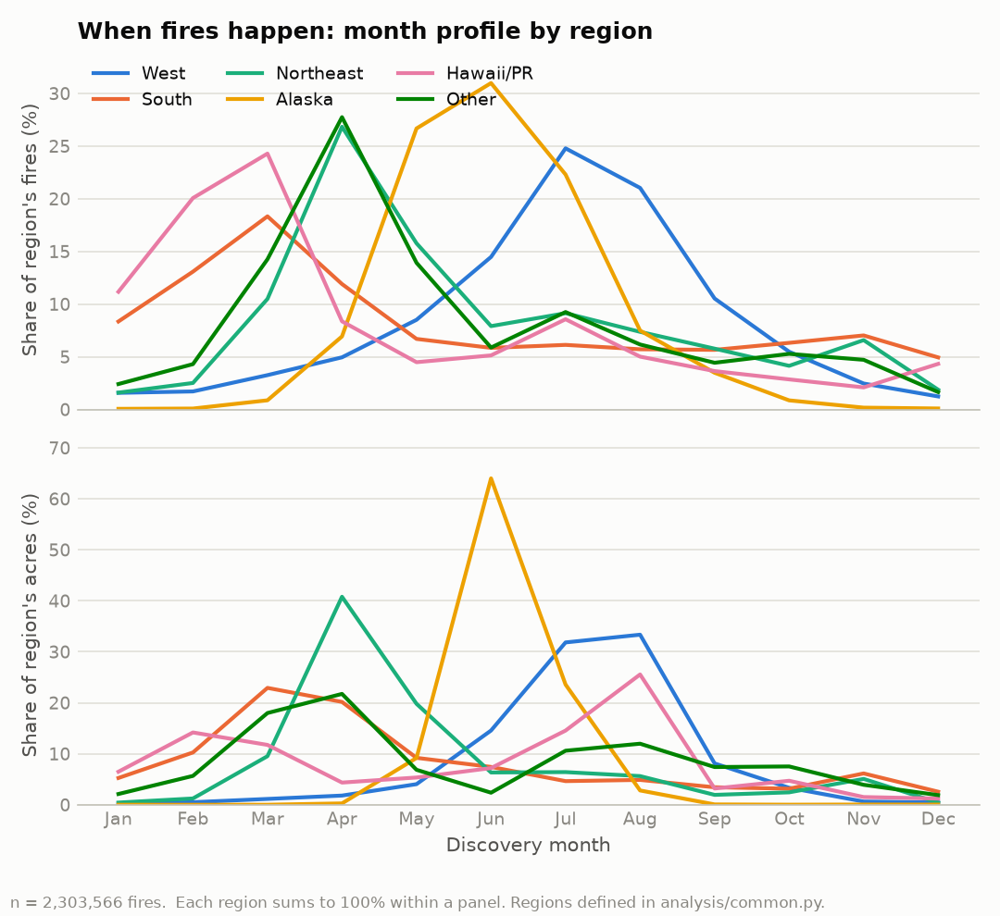
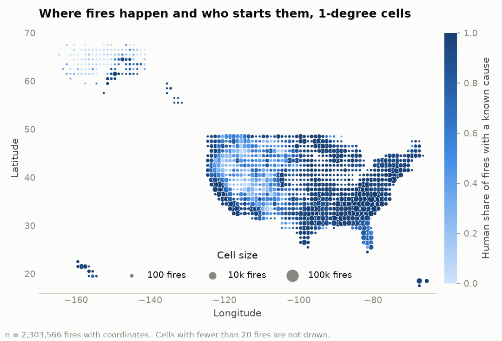
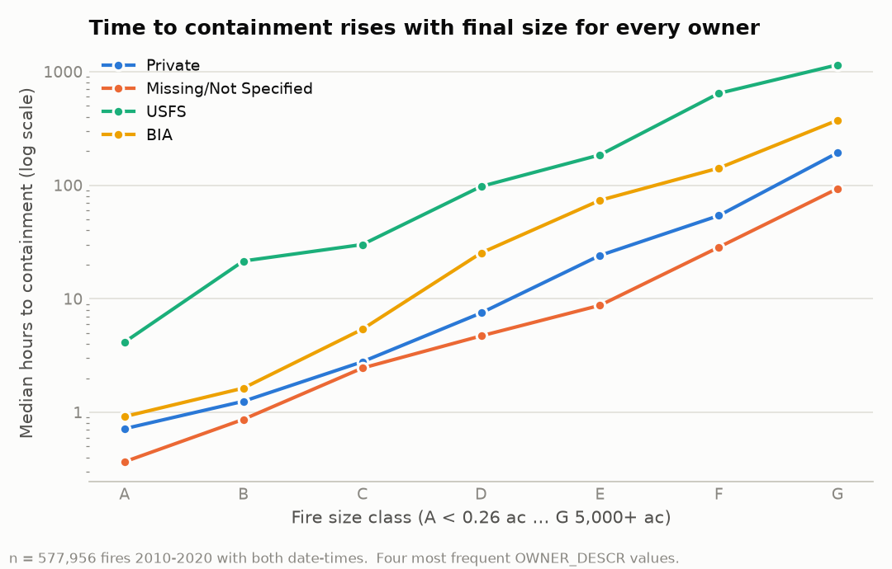
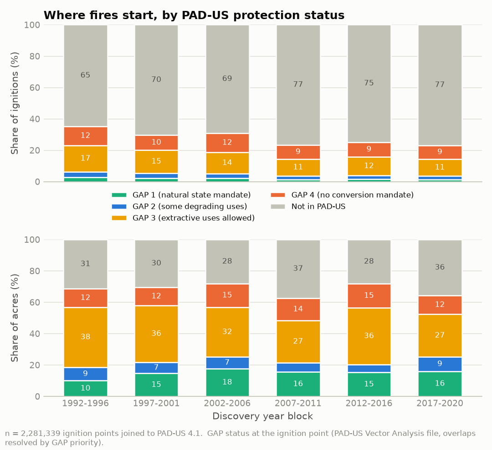
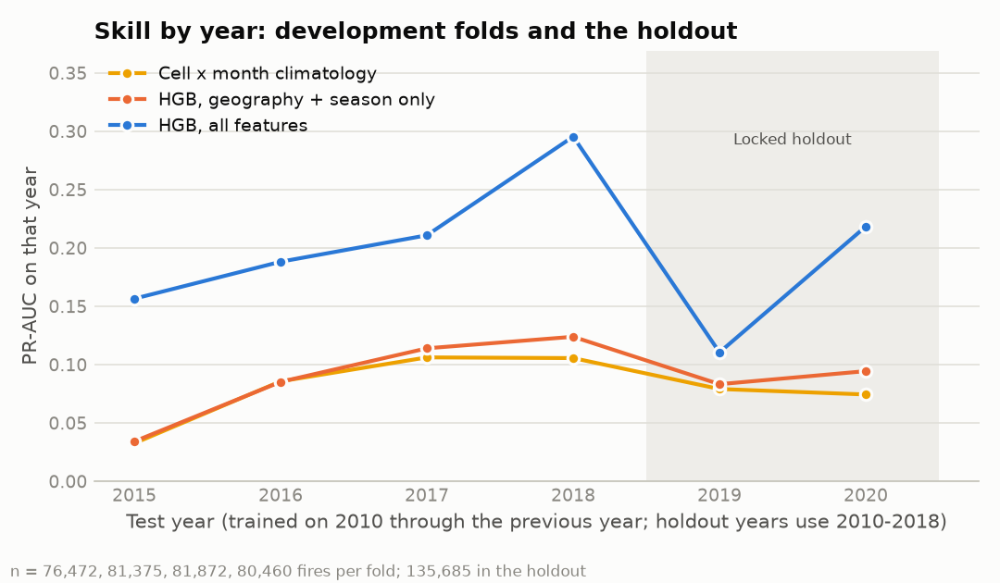

# Wildfire analysis: 2.3 million US fire records, 1992–2020

**Large wildfires in the West burn about twice the area they did in the 1990s. The number of recorded fires has not grown. And much of what looks like change in this record is change in who reports.**

I lived in Los Angeles for ten years, and over that time it felt like the fires kept getting worse. I wanted to find out whether that impression holds up against the data. This repository is the second version of that attempt. The first version, a Tableau story and a Random Forest that estimated how long a fire would burn, was put through an adversarial review that reproduced every number and then tested every sentence. Most of the numbers held. Several of the sentences did not. What is here now is what survived, plus what the review showed the data can actually support: a coverage-aware descriptive analysis, a calibrated probability that a newly reported fire becomes large, and a conservation view built on joins the record already carries. Every number below is generated by code and tagged with the claim it comes from (`outputs/claims*.json`), and a test fails if the two drift apart.

The site: **https://wildfire-record-review.netlify.app** (password-protected while it is reviewed; generated from the same claims by `scripts/build_site.py`). The review: `docs/review/PANEL_REPORT.md`. The log of every experiment, including the ones that made things look worse: `docs/EXPERIMENTS.md`.

## What this data is, and is not

The records are the Fire Program Analysis fire-occurrence database, 6th edition (Short 2022, https://doi.org/10.2737/RDS-2013-0009.6): 2,303,566 wildfire records <!-- claim:overview.n_rows --> from 1992 to 2020, each with a discovery date, a final size and an ignition point. It is hosted by the Forest Service Research Data Archive, but it is not a Forest Service record. It is a compilation of dozens of federal, state and local reporting systems, and two thirds to four fifths of the records in any year come from non-federal systems. Its own metadata says counts "may underrepresent actual wildfire activity in certain areas and time periods," and that area burned is more robust than counts because large fires are reported by more than one agency.

That shapes everything below:

- **Counts are not a trend.** 30 of the 48 states with at least 1,000 records <!-- claim:coverage.n_states_ge_1000_with_break --> have a year in which the count jumps by more than 3x or falls by more than two thirds. Texas goes from 1,040 records in 2004 to 15,019 in 2006 when the state forest service began compiling local reports. New York goes from 129 in 1994 to 7,700 in 2005. `analysis/coverage.py` flags these breaks and the site shows them; no count series is presented here without that mask.
- **Ownership is unrecorded for 46.4% of fires** <!-- claim:owner.missing_share_fires -->, almost entirely among state, county and local reporters. Every ownership comparison shows that row.
- **A general cause is missing or undetermined for 26.0% of fires** <!-- claim:overview.missing_shares --> (8.4% have no cause classification at all). Cause charts show three categories: human, natural, undetermined.
- **The containment date is missing for 894,813 records** <!-- claim:overview.missing_counts --> (38.8%), the discovery time for 789,095. Missingness is structured: 88% of Texas's 2010+ records and 94% of Virginia's have no containment date. And the field records when a fire was *declared* contained under each reporting system's convention, not when it stopped burning.
- Fire sizes run from 0.00001 acres to the 662,700-acre Starbuck fire in Oklahoma in 2017 <!-- claim:overview.largest_fire_acres -->. Fires of 5,000+ acres (Class G) are 0.2% of records and 75.1% of all acres <!-- claim:year.acres_share_by_size_class -->.

The data terms and every source's citation are in `docs/DATA_TERMS.md`.

## Findings

### Are fires getting worse? Large-fire area is up. Fire counts are not.

Acres burned in Class G fires trend upward from 1992 to 2020: Kendall tau 0.43 (p = 0.0007), a Theil–Sen slope of +178,000 acres per year (95% interval 69,000 to 288,000) <!-- claim:class_g.acres_trend -->. The mean annual Class G area rose from 3.5 million acres in 1992–2005 to 5.7 million in 2006–2020 <!-- claim:class_g.half_period_means -->. Alaska holds 26% of those acres <!-- claim:class_g.alaska_share_of_acres --> and has no trend of its own; without Alaska the trend still holds (tau 0.35, p = 0.007, +142,000 acres per year) <!-- claim:class_g.acres_trend_excl_alaska --> and the two-period means are 2.2 and 4.7 million acres. In the 11 Western states alone, the mean rose from 1.9 million to 3.8 million acres per year (tau 0.34, p = 0.009) <!-- claim:class_g.half_period_means_west --> <!-- claim:class_g.acres_trend_west -->, and every one of the eleven states burned more Class G acres per year in 2006–2020 than in 1992–2005, from 1.1x in Nevada to 3.2x in Washington <!-- claim:class_g.west_ratio_by_state -->. The count of Class G fires rises too (tau 0.35, p = 0.007) <!-- claim:class_g.fires_trend -->, and 92% of them carry a satellite-mapped perimeter, so they are not a reporting artifact.

The trend is carried by extreme years. Drop the top three and the non-Alaska series falls to p = 0.09. That is what a fire regime driven by a few severe seasons looks like, but it means the honest sentence is "higher highs," not "higher highs and higher lows": 2010 is the fifth-lowest year in the record <!-- claim:class_g.five_lowest_years -->.

The total number of recorded fires shows no trend at all (tau 0.10, p = 0.47) <!-- claim:year.fires_trend -->. The peak count year is 2006 <!-- claim:year.fires_and_acres_peak -->, which is the year Texas's reporting arrived, not a year of unusual fire.

This record cannot say why large-fire area is rising. It has no weather, no fuels and no exposure denominator. For attribution, see the literature summarized in `docs/research/LITERATURE.md`.

For Los Angeles specifically, the record cannot answer my question: half of California's 2010+ fires have no containment date, and the large-fire trend is a Western one, not a local one.



### Causes: people start most fires; lightning burns most of the land

Human causes account for 77.4% of fires and 35.3% of acres. Natural causes (lightning, in practice) account for 14.2% of fires and 58.7% of acres, 105.6 million acres in total. The remaining 8.4% of fires have no cause classification <!-- claim:cause.by_classification -->. The national natural-acres figure is mostly a Western and Alaskan one: in the West, 62% of acres are natural-cause and only 58% of fires are human-caused; in the South, 88% of fires and 69% of acres are human-caused; in Alaska, 94% of acres are natural <!-- claim:cause.by_region_classification -->.

Among fires with a known cause, the human share falls with size: 90% of Class B fires, 78% of Class D, and 35% of Class G <!-- claim:cause.human_share_known_by_size_class -->. The most common recorded cause of Class B fires is debris and open burning at 30% and of Class C fires arson at 26% <!-- claim:cause.top_general_cause_by_size_class -->; these are pluralities, and a quarter of each class has no recorded general cause.



### When and where

The South leads Class G fire counts from November through April; the West leads from May through October <!-- claim:season.class_g_leading_region_by_month -->. Fire counts peak in March in the South, July in the West, April in the Northeast, and June in Alaska <!-- claim:season.peak_month_by_region -->. Human-caused ignitions peak in February–April east of the Rockies and June–August in the West, which is the calendar that prevention messaging should follow.

Alaska's fires last longest by far: a mean of 13.1 days between discovery and containment declaration, against 1.6 days in the West and under a day everywhere else <!-- claim:season.duration_days_by_region -->. The West's mean peaks in August <!-- claim:season.west_mean_duration_days_by_month -->.





### Ownership, and what "response" can and cannot mean here

By acres burned: USFS land 38.4 million, BLM 37.2 million, private 25.6 million, and **unrecorded ownership 22.9 million** <!-- claim:owner.top4_acres -->. That fourth row was missing from the first version of this analysis.

The first version also built a "Control Efficiency Score" (1 ÷ mean acres burned per hour to containment) to compare how quickly owners bring fires under control. It is retired. The mean is dominated by a handful of wind-driven runs, so USFS ranks near the bottom by mean and first by median; the two rankings have a Spearman correlation of 0.09 <!-- claim:ces.spearman_mean_vs_median -->. Stratifying by size class does not rescue it: within every class, the median time to a containment declaration on USFS land is 5 to 20 times that on private land (Class A: 4.2 hours vs 0.7; Class E: 185 hours vs 24) <!-- claim:cont.median_hours_by_size_class_and_owner_2010_plus -->. Nobody who has worked an incident believes a 300-acre fire on private land is contained in a day while the same fire on Forest Service land takes a week. The gap is what each reporting system means by "contained," plus detection lag, access and managed natural ignitions. The table is kept on the site as a description of reporting conventions, not of response.



### Conservation view

The ignition record says where fires start, not what they burn or what they cost. Two joins the record already has keys for add some of that. `docs/findings/conservation.md` has the full tables and caveats.

**Where fires start, by protection status.** Every ignition point was placed in the Protected Areas Database (PAD-US 4.1). Land managed for biodiversity with natural disturbance allowed (GAP 1) receives 1.9% of ignitions but 15.4% of acres burned <!-- claim:padus.by_gap_all_years -->, because the fires that start there are mostly lightning fires that grow: 6.2% of them reach 300 acres. The human share of known-cause ignitions rises from 34% on GAP 1 land to 93% outside protected areas <!-- claim:padus.by_gap_all_years -->. Of human-caused ignitions inside PAD-US units in 2010–2020, 39% fall in tribal reservations and Oklahoma tribal statistical areas <!-- claim:padus.human_ignitions_share_in_tribal_units_2010_2020 -->, which are jurisdictions that include private land, not conservation units; the write-up ranks units with and without them.

**The missing owner, found.** Of the records with no owner, 91% fall outside any PAD-US unit <!-- claim:padus.missing_owner_assignment_all_years -->, which in the US is predominantly private land. Where an owner is recorded, it agrees with PAD-US's manager type for 85% of fires <!-- claim:padus.owner_agreement_overall -->.

**What large fires cost.** For the 9,609 incidents of 300+ acres in 2010–2020 that filed an incident report (ICS-209-PLUS) <!-- claim:ics.sample_n -->, human-caused fires destroyed 45,784 structures <!-- claim:ics.outcomes_by_cause --> of 66,406 in total <!-- claim:ics.outcomes_total -->, about eight times the structures per acre burned of lightning fires. Loss is a tail: 86% of incidents destroyed no structure, and the ten largest hold 52% of everything destroyed <!-- claim:ics.structures_destroyed_distribution -->.

Every PAD-US number is about the ignition point, not the burned footprint, and outcomes exist only for incidents that filed a report (80% of 2010–2020 fires of 300+ acres, fewer in earlier years).



## Prediction: will a newly reported fire become large?

### What the first version got wrong

The first version trained a Random Forest to predict fire duration in days from location, day of year and cause. Its numbers reproduce exactly (test RMSE 6.60 days, MAE 1.38) <!-- exp:E-001 -->, and they were the wrong numbers to look at:

- On the typical fire it is worse than a constant. 84% of fires are contained the day they are found; predicting zero days for every fire gives an MAE of 1.09 against the model's 1.38 <!-- exp:E-002 -->.
- Its RMSE gain over predicting the mean was a random-split artifact: 9% on the original split, 3% when trained on 2010–2017 and tested on 2018–2020, and negative in 2018 <!-- exp:E-004 -->.
- Latitude and longitude alone recover 83% of its skill <!-- exp:E-006 -->. It was a map, not a model.
- The training sample silently dropped the 26% of 2010+ fires with no containment date, including 88% of Texas.
- As an early warning it fails at every threshold: to catch nine in ten fires that will burn a month it must flag a third of all fires; to keep flags rare it misses two thirds of them.

The code is still here and still runs (`python run_pipeline.py`); the result is logged as a negative one.

### The replacement

The question practitioners ask at initial attack is not "how long will this burn?" but "is this one of the fires that gets big?". About 1 in 80 new fires reaches 300 acres. That target uses every fire in the record, including the quarter with no containment date.

**The model.** Gradient boosting on 96 inputs known on the discovery day: location, season, cause, owner and reporting agency, plus same-day weather, weather normals, fuels, terrain, vegetation, protection status, social context and suppression context from the FPA FOD-Attributes dataset, joined on the fire ID. It was developed on 2010–2018 with forward-in-time folds and evaluated **once** on the 135,685 fires of 2019–2020, which were locked before development began (`docs/EXPERIMENTS.md`, E-010 to E-015).

**What it can do: rank.** On 2019–2020 fires it never saw, its top 10% of scores held 74% of the fires that became large <!-- claim:model.capture_at_top -->, against 45% for a lookup of each place's historical rate by month. Its precision-recall AUC is 0.139, with a 95% interval of 0.127 to 0.151, against 0.075 for the lookup <!-- claim:model.holdout_overall -->.

| On 2019–2020 fires | Top 5% of scores | Top 10% | Top 20% |
|---|---|---|---|
| This model | 57% | 74% | 88% |
| Lookup: 1-degree cell by month | 31% | 45% | 64% |
| Flagging at random | 5% | 10% | 20% |

**What it cannot do: say how likely.** Its scores are not probabilities. For the tenth of fires it scored highest, the mean score was 16.5% and the share that became large was 9.4% <!-- claim:model.calibration_failure -->. Read as probabilities, the scores do worse than one constant rate: Brier skill −0.85 in 2019, a quiet year after two large seasons, and +0.12 in 2020 <!-- claim:model.calibration_failure -->. A calibration step chosen before the test did not fix it. The site shows ranks and capture rates, never a percent chance.

**What carries the ranking: place, not the day's weather.** Shuffling the fuels, terrain and ecoregion inputs costs the most skill, then protection status and social context, then owner and agency. Same-day weather adds nothing measurable, in the development ablation or on the holdout <!-- exp:E-011 --> <!-- exp:E-015 -->. That is not a claim that weather does not matter to fire growth. Growth depends on the days after discovery, and the model only knows the discovery day.

**Where it fails.** It ranks Southern fires worse than the lookup, except in Texas. It excludes Alaska, Hawaii and Puerto Rico, because the attributes cover the conterminous US only. And because owner, agency and protection status carry so much of the signal, part of what it learns is where fires are fought and reported, not only how they behave. It is not for any decision about an actual fire. The model card (`docs/MODEL_CARD.md`) lists what it is and is not for.



## Errata from the first version

- **"A June spike in Class G acreage in Arkansas."** Arkansas has two Class G fires in 29 years, in March and April. Arizona (100 fires, 2.8 million acres) and Alaska (443 fires, 22.7 million acres) both peak in June <!-- claim:anom.june_class_g_by_state_top10 -->. The Tableau label was almost certainly AZ or AK misread as AR.
- **"December fires in Texas."** December ranks 10th of 12 months for Texas by both fires and acres. One December stands out, 2005, at 94,523 acres, which is also the first year of Texas A&M's compiled local reporting <!-- claim:anom.texas_december_top_year -->.
- **"A 2010 outlier in the Northeast."** With a nine-state Northeast, 2010 is an ordinary year (z = 0.98 on counts). The series is a reporting series: its largest jumps are in 2005, 2015 and 2020, New York is 55% of it, and Rhode Island has 13 zero-record years <!-- claim:anom.northeast_zero_report_years -->.
- **"The model does well on the many short fires."** It predicts about half a day for fires that lasted zero days and loses to a constant on them.
- **"Test RMSE is about 6% better than always predicting the average."** Understated on the original split (9%) and overstated for any real use (3% forward in time).

## Version 2 of the site: for people who act on it

The site was rebuilt for prevention planners, land managers, and the public, reporters and officials. It adds:

- a map of every fire, with filters and counts on click;
- a printable brief for each state;
- a prevention calendar by region, month and cause, including the 4 July spike;
- the largest fires, counted once per incident;
- the national NIFC series to 2025;
- the first public site's drought analysis, replicated and tested forward in time;
- a forward test of the large-fire ranking on 2021-2025 WFIGS fires.

That forward test failed as specified. A diagnostic run afterwards traces the failure to one input whose coding differs between the two reporting systems. What held and what changed from the first public site: `docs/review/V1_SITE_AUDIT.md`. Write-ups: `docs/findings/places_and_calendar.md`, `docs/findings/nifc_and_drivers.md`, `docs/findings/wfigs_2021_2025.md`. Experiments: E-016 to E-018. Every number on every generated page is checked against the ledger by `tests/test_site_claims.py`.

## How to run

```bash
python3.12 -m venv .venv && source .venv/bin/activate   # Windows: .venv\Scripts\activate
pip install -r requirements.txt

python scripts/download_data.py      # 214 MB zip, 958 MB SQLite into data/; verified against data.sha256
python scripts/build_cache.py        # data/fires.parquet (86 MB), the file every analysis reads
python -m analysis.descriptive       # outputs/claims.json and outputs/figures/
python -m analysis.coverage          # outputs/coverage.json
python scripts/reproduce.py          # regenerates the first version's numbers and the baselines
python -m analysis.incidents         # outputs/claims_incidents.json, outputs/tables/largest_incidents.csv
python -m analysis.places            # outputs/claims_places.json, outputs/tables/ (needs the coverage mask)
python -m analysis.nifc              # national totals 1983-2025 (fetches NIFC)
python -m analysis.drivers           # drought replication and tests (fetches NOAA nClimDiv)
python -m analysis.wfigs             # 2021-2025 WFIGS incidents and the forward test (fetches WFIGS)
python scripts/build_site.py         # site/, including the map's point files (not committed)
pytest -q                            # tests on a synthetic database and on the committed ledgers and site; no download needed
```

The v2 modules and the map need `pip install -r requirements-analysis.txt`.

The conservation joins and the large-fire model need external data: `python scripts/download_external.py` (ICS-209-PLUS, PAD-US) and `python scripts/download_attributes.py` (FPA FOD-Attributes, 2.2 GB for 2010–2020). Hashes are recorded in `docs/DATA_JOINS.md`.

## Repo layout

```
analysis/            descriptive.py, coverage.py, conservation.py, large_fire.py, common.py, figures.py
src/                 the first version's loader, features and model (kept runnable; see EXPERIMENTS.md)
scripts/             download_*.py, build_cache.py, reproduce.py, build_site.py, sync_backlog.py
outputs/             claims*.json, figures/, cells_1deg.csv (committed); everything else regenerated
site/                the static site Netlify publishes
tests/               pytest suite on a synthetic SQLite fixture
docs/review/         REPRODUCTION.md, the five panel reviews, PANEL_REPORT.md
docs/findings/       descriptive.md, conservation.md, large_fire_model.md, tests_summary.md
docs/research/       DATA_SOURCES.md, LITERATURE.md (every link fetched)
docs/                EXPERIMENTS.md, MODEL_CARD.md, DATA_VERSION.md, DATA_JOINS.md, DATA_TERMS.md, SITE.md
BACKLOG.md           the improvement program, mirrored to GitHub issues
```

## Stack

Python, pandas, DuckDB, scikit-learn, GeoPandas, Matplotlib, Plotly.js, pytest, GitHub Actions, Netlify.

## License

Code is MIT licensed (`LICENSE`). The data belong to their publishers and are used under the terms in `docs/DATA_TERMS.md`; the aggregates published here are derived by this project and are not products of the USDA Forest Service or any other source agency.
